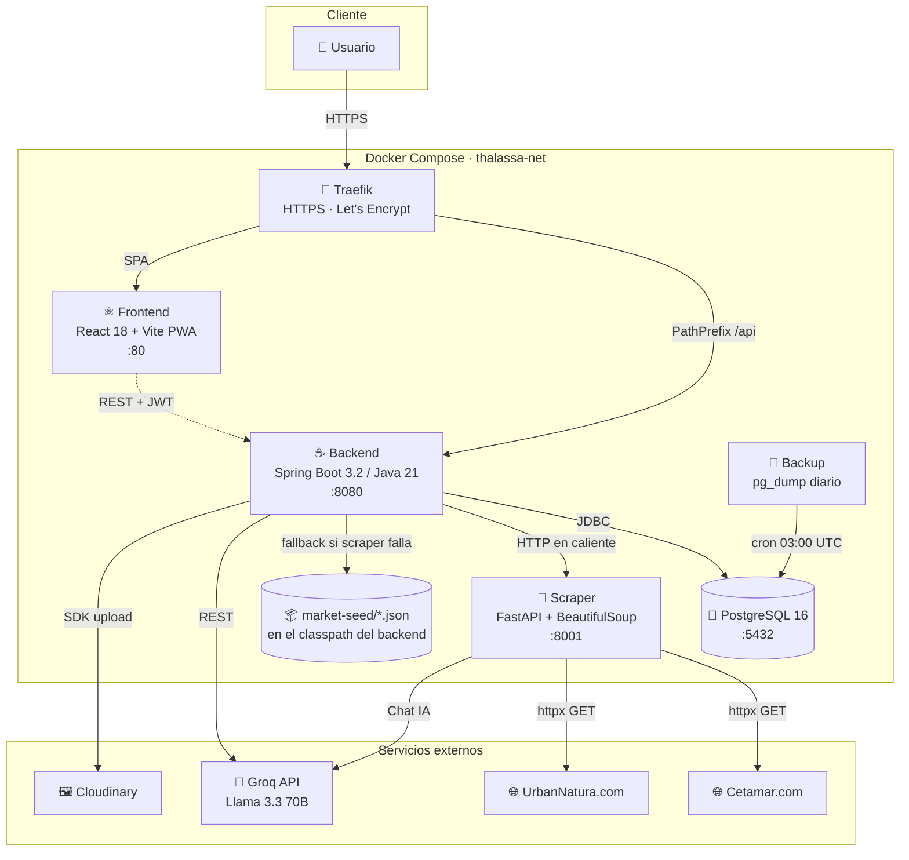

# 🌊 Thalassa

<p align="center">
  <strong>Plataforma full-stack para la gestión de acuarios marinos</strong><br/>
  <em>Spring Boot · React PWA · FastAPI · PostgreSQL · Docker</em>
</p>

<p align="center">
  
  
  
  
  
  
  
  
</p>

---

## 📑 Índice

1. [Visión general](#-visión-general)
2. [Funcionalidades reales](#-funcionalidades-reales)
3. [Arquitectura](#-arquitectura)
4. [Stack tecnológico](#-stack-tecnológico)
5. [Despliegue con Docker](#-despliegue-con-docker)
6. [Resolución de problemas](#-resolución-de-problemas)
7. [Estructura del repositorio](#-estructura-del-repositorio)

---

## 🐠 Visión general

**Thalassa** es una aplicación web pensada para aficionados a la acuariofilia marina. Permite llevar el control de uno o varios acuarios: el historial de parámetros del agua, el inventario de equipamiento y de fauna, el coste energético mensual, una wishlist de productos y un comparador de precios entre las principales tiendas españolas del sector.

El proyecto se distribuye como tres microservicios independientes que se orquestan con **Docker Compose** detrás de un proxy **Traefik**.

---

## ✅ Funcionalidades reales

> Esta tabla refleja **únicamente** lo que está implementado y operativo en el código fuente. No se incluyen módulos que aún sean mocks o stubs.

| 🧩 Módulo | Descripción | Endpoints / Componentes |
|---|---|---|
| 🔐 **Autenticación JWT** | Registro, login, refresh rotativo (15 min access · 30 d refresh), logout y recuperación de contraseña por email. | [AuthController.java](backend/src/main/java/com/thalassa/backend/controllers/AuthController.java) |
| 🐟 **Gestión de acuarios** | CRUD de acuarios (litros, tipo FOWLR/REEF) con gate freemium: el plan FREE limita a **1 acuario**. | [AquariumController.java](backend/src/main/java/com/thalassa/backend/controllers/AquariumController.java) |
| 💧 **Parámetros del agua** | Registro histórico de pH, salinidad, temperatura, alcalinidad, calcio, magnesio, nitratos, fosfatos. Listado paginado, **exportación a CSV** y gráficas con Recharts. | [WaterParameterService.java](backend/src/main/java/com/thalassa/backend/services/WaterParameterService.java) |
| 🐡 **Inventario de fauna** | Alta/baja/edición de especímenes con marcado reef‑safe y enlace al catálogo. Advertencia al añadir fauna no reef‑safe en acuarios de tipo REEF. | [LivestockController.java](backend/src/main/java/com/thalassa/backend/controllers/LivestockController.java) |
| ⚙️ **Equipamiento + energía** | CRUD de equipos (potencia W, horas/día) y **cálculo del coste energético mensual** a partir del precio del kWh configurado por el usuario. | [EquipmentController.java](backend/src/main/java/com/thalassa/backend/controllers/EquipmentController.java) |
| 📚 **Catálogo de especies** | Búsqueda case‑insensitive por nombre común o científico, detalle por ID. | [SpeciesCatalogController.java](backend/src/main/java/com/thalassa/backend/controllers/SpeciesCatalogController.java) |
| 🛒 **Mercado comparador** | Búsqueda en caliente contra el microservicio Python que scrapea **Cetamar** y **Urban Natura** con BeautifulSoup. Resiliencia con seed cache (ver más abajo). | [MarketPage.tsx](frontend/src/features/market/MarketPage.tsx) · [ScraperController.java](backend/src/main/java/com/thalassa/backend/controllers/ScraperController.java) |
| ❤️ **Wishlist** | Guarda productos del mercado (o personalizados) con notas, prioridad y categoría. CRUD con validación de ownership. | [WishlistController.java](backend/src/main/java/com/thalassa/backend/controllers/WishlistController.java) |
| 🤖 **Chat IA** | Asistente especializado en acuariofilia. Proxy Spring Boot → FastAPI → **Groq (Llama 3.3 70B)**. Rate‑limit diario: 5 mensajes para el plan FREE, ilimitado para REEFMASTER. | [ChatService.java](backend/src/main/java/com/thalassa/backend/services/ChatService.java) |
| 🧮 **Calculadoras** | Calculadora de dosificación de elementos y calculadora de coste energético (vista cliente). | [DosingCalcPage.tsx](frontend/src/features/calculators/DosingCalcPage.tsx) · [EnergyCalcPage.tsx](frontend/src/features/calculators/EnergyCalcPage.tsx) |
| 🖼️ **Subida de imágenes** | Upload a **Cloudinary** (JPEG/PNG/WebP, máx. 5 MB) para avatares, fauna, equipamiento y wishlist. | [UploadController.java](backend/src/main/java/com/thalassa/backend/controllers/UploadController.java) |
| 💳 **Plan FREE / REEFMASTER** | Endpoint de simulación de upgrade para QA/dev (sin pasarela de pago real) y `PlanGate` en frontend. | [UserController.java](backend/src/main/java/com/thalassa/backend/controllers/UserController.java) · [PlanGate.tsx](frontend/src/components/shared/PlanGate.tsx) |
| 📊 **Dashboard** | Resumen global: nº de acuarios, fauna total, equipamiento total. | [DashboardController.java](backend/src/main/java/com/thalassa/backend/controllers/DashboardController.java) |
| 🌍 **Internacionalización** | Español, inglés y alemán con `i18next`. | [frontend/src/i18n/](frontend/src/i18n/) |
| 📱 **PWA** | Instalable y con service worker vía `vite-plugin-pwa`. | [frontend/package.json](frontend/package.json) |

---

## 🏗️ Arquitectura

Thalassa se compone de **tres servicios independientes** orquestados por Docker Compose, más una base de datos PostgreSQL y un proxy Traefik que termina TLS en producción.



### 🛡️ Sistema de resiliencia del mercado comparador

El comparador de precios **no falla nunca de forma visible al usuario**, incluso si los sitios externos están caídos o si el ISP del usuario los bloquea. El sistema combina tres capas:

1. **Scraper Python (capa 1 — live).** [ScraperService.search](backend/src/main/java/com/thalassa/backend/services/ScraperService.java) llama a `GET /scrape?keyword=…` del microservicio FastAPI, que dispara en paralelo (`asyncio.gather`) los scrapers de **Cetamar** y **Urban Natura**. Un fallo de una tienda **no cancela** los resultados de la otra.

2. **Seed cache del backend (capa 2 — fallback).** Si Python devuelve `errorCode`, lista vacía, o si una tienda concreta no devuelve productos, el backend **inyecta datos semilla locales** desde `backend/src/main/resources/market-seed/cetamar.json` y `urbannatura.json` (hasta 10 ítems por tienda, priorizando los que coincidan con la keyword). El campo `fromCache: true` lo señala en la respuesta para mostrarse como badge en el frontend.

3. **Placeholder SVG en el frontend (capa 3 — fallos de imagen).** Las URLs de imagen apuntan a CDNs externos que algunos ISPs españoles bloquean. Cuando el `` falla, [ProductCard](frontend/src/features/market/MarketPage.tsx) sustituye la imagen rota por el SVG local **[`/market-placeholder.svg`](frontend/public/market-placeholder.svg)** — sin hacer ninguna petición de red, evitando bloqueos del navegador.

> Resultado: aunque toda la red externa esté caída, el módulo de mercado sigue mostrando productos comparables sin imágenes rotas ni errores 500.

---

## 🧰 Stack tecnológico

| Capa | Tecnología | Versión | Rol |
|---|---|---|---|
| ☕ **Backend** | Spring Boot · Java | 3.2.5 · 21 | API REST, JWT, JPA/Hibernate, Flyway, Spring Security |
| ⚛️ **Frontend** | React · Vite · TypeScript | 18 · 6 · 5 | SPA + PWA, React Router 6, React Query, Zustand, Zod, Tailwind CSS 4, Recharts, i18next |
| 🐍 **Scraper** | Python · FastAPI · BeautifulSoup | 3.12 · 0.115 · 4.12 | Microservicio asíncrono de scraping (`httpx` + `lxml`) y proxy de IA |
| 🤖 **IA** | Groq SDK + Llama 3.3 70B | 1.2.0 | Asistente conversacional de acuariofilia |
| 🐘 **Base de datos** | PostgreSQL | 16-alpine | Persistencia relacional + migraciones Flyway |
| 🔀 **Proxy** | Traefik | v3.3 | Reverse proxy, redirect HTTP→HTTPS, Let's Encrypt (HTTP‑01) |
| 🐳 **Orquestación** | Docker Compose | — | Despliegue completo con un único comando |
| 🖼️ **CDN imágenes** | Cloudinary | — | Almacenamiento de imágenes de usuario |
| 📊 **Observabilidad** | Sentry · Spring Actuator | — | Errores frontend + healthcheck `/actuator/health` |

---

## 🚀 Despliegue con Docker

> Requisitos: **Docker Desktop** (Windows/macOS) o Docker Engine + Compose v2 en Linux. Aproximadamente **4 GB de RAM** libres para los cuatro contenedores.

### 1️⃣ Clonar el repositorio

```bash
git clone https://github.com/IkerMG/Thalassa.git
cd Thalassa
```

### 2️⃣ Crear el archivo `.env`

Copia la plantilla y rellena los valores reales:

```bash
# Linux / macOS
cp .env.example .env

# Windows PowerShell
Copy-Item .env.example .env
```

Variables que **debes** rellenar antes de levantar:

| Variable | Descripción | Cómo obtenerla |
|---|---|---|
| `JWT_SECRET` | Clave HMAC para firmar el access token | `openssl rand -hex 64` |
| `JWT_REFRESH_SECRET` | Clave HMAC para el refresh token (distinta de la anterior) | `openssl rand -hex 64` |
| `POSTGRES_USER` · `POSTGRES_PASSWORD` | Credenciales de la BD interna | Inventa una contraseña fuerte |
| `GROQ_API_KEY` | API key del LLM (Llama 3.3) | https://console.groq.com/keys |
| `CORS_ALLOWED_ORIGINS` | Orígenes permitidos por CORS | Ej. `http://localhost:5173` para dev |
| `SPRING_PROFILES_ACTIVE` | Perfil de Spring | `dev` para desarrollo · `prod` para producción |
| `DOMAIN` · `ACME_EMAIL` | Dominio público + email para Let's Encrypt | Solo para producción |
| `CLOUDINARY_*` | Credenciales Cloudinary | https://cloudinary.com/console (necesario para subir imágenes) |

### 3️⃣ Levantar la pila completa

```bash
docker compose up -d --build
```

Esto construye y arranca los seis servicios:

| Servicio | URL local | Puerto |
|---|---|---|
| Frontend (PWA) | http://localhost:5173 | 5173 → 80 |
| Backend API + Swagger | http://localhost:8080/swagger-ui.html | 8080 |
| Scraper docs | http://localhost:8001/docs | 8001 |
| Traefik | http://localhost | 80/443 |
| PostgreSQL | _(interno)_ | 5432 |
| Backup | _(cron 03:00 UTC)_ | — |

Comprueba el estado con `docker compose ps`. El backend tiene healthcheck contra `/actuator/health`, así que el contenedor pasará a `healthy` cuando esté listo para recibir tráfico.

### 4️⃣ Comandos útiles

```bash
docker compose logs -f backend     # ver logs en vivo
docker compose down                # parar todo
docker compose down -v             # parar y borrar volúmenes (¡borra la BD!)
docker compose restart scraper     # reiniciar un servicio
```

---

## 🛠️ Resolución de problemas

### ⚠️ Timeout al descargar imágenes Docker (`failed to fetch oauth token` / `i/o timeout`)

Algunos ISPs españoles (Movistar, Vodafone…) y redes corporativas bloquean o degradan las conexiones al **Docker Hub** y a `registry-1.docker.io`. Síntoma típico:

```
ERROR: failed to solve: failed to fetch oauth token: Get https://auth.docker.io/...: net/http: TLS handshake timeout
```

**Solución:** configurar un **registry mirror** en Docker Desktop apuntando al espejo público de Google (`mirror.gcr.io`).

1. Abre Docker Desktop → **Settings** → **Docker Engine**.
2. Añade `registry-mirrors` al JSON:
   ```json
   {
     "registry-mirrors": ["https://mirror.gcr.io"]
   }
   ```
3. Pulsa **Apply & Restart** y vuelve a lanzar `docker compose up -d --build`.

### 🖼️ El mercado muestra imágenes con el placeholder SVG

Es el comportamiento esperado cuando el ISP bloquea el CDN de Cetamar / Urban Natura. La aplicación cae automáticamente al SVG local `/market-placeholder.svg` para no romper el layout. Los enlaces «Ver producto» siguen funcionando.

### 🤖 El scraper se queda en `unhealthy`

El healthcheck del servicio `scraper` exige que `GROQ_API_KEY` esté definido y **no sea** un placeholder. Asegúrate de haber sustituido el valor en `.env` y reinicia el contenedor:

```bash
docker compose up -d --force-recreate scraper
```

### 🔁 Errores 401 inesperados en el frontend

El access token caduca a los 15 minutos. El interceptor de axios refresca automáticamente, pero si el refresh también ha expirado (30 días) la app dispara el evento `auth:expired` y redirige a `/login`. Vuelve a iniciar sesión.

---

## 📁 Estructura del repositorio

```
Thalassa/
├── backend/        # Spring Boot 3.2 · Java 21 · PostgreSQL · Flyway
│   └── src/main/resources/market-seed/   ← datos semilla del mercado
├── frontend/       # React 18 · Vite · TypeScript · Tailwind · PWA
│   └── public/market-placeholder.svg     ← fallback de imágenes rotas
├── scraper/        # FastAPI · BeautifulSoup · Groq
│   └── app/services/{cetamar,urbannatura}.py
├── scripts/        # backup.sh (pg_dump diario)
├── docker-compose.yml
├── docker-compose.override.yml   # overrides locales (sin TLS)
├── traefik-dev.yml
└── .env.example
```

---

<p align="center">
  <em>Proyecto Final · Desarrollo de Aplicaciones Web · ILERNA</em><br/>
  <sub>© 2026 · Iker Mozo Gamero — Trabajo académico</sub>
</p>
