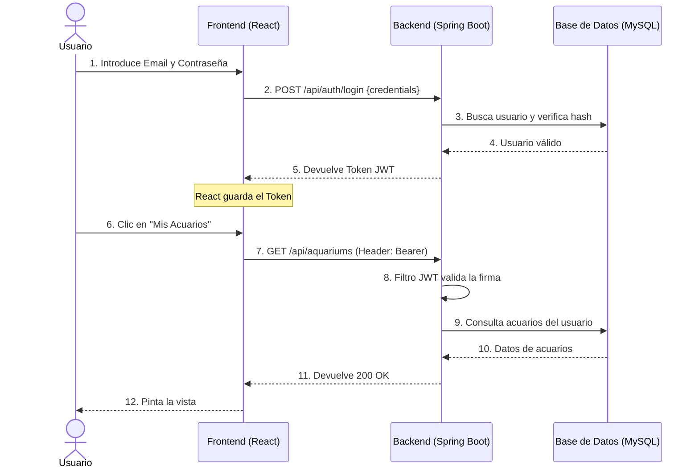

# 02.1 Arquitectura y Seguridad (JWT)

## 1. Sistema Distribuido
El proyecto **Thalassa** utiliza una arquitectura de microservicios para separar responsabilidades, mejorar la escalabilidad y facilitar el mantenimiento.

* **☕ Java Spring Boot:** Gestiona la persistencia de datos (JPA), la seguridad del sistema (Spring Security con JWT) y la lógica de negocio principal.
* **🐍 Python FastAPI:** Microservicio especializado en Web Scraping. Utiliza BeautifulSoup para extraer precios en tiempo real de tiendas del sector como Kiwoko o Tiendanimal.
* **🔌 Comunicación Interna:** Java actúa como cliente del servicio Python mediante `WebClient` o `RestTemplate`, solicitando datos de scraping bajo demanda.

## 2. Estrategia de Seguridad (Stateless JWT)
Dado que el Frontend y el Backend están separados, no utilizamos sesiones de servidor tradicionales. Hemos implementado **Spring Security con JWT**.

* **Autenticación:** Al hacer login, el servidor valida las credenciales y devuelve un Token JWT firmado criptográficamente.
* **Autorización:** El cliente guarda este token y lo envía en la cabecera HTTP (`Authorization: Bearer <token>`) en cada petición.
* **Ventajas:** El servidor Java no guarda el estado de la sesión, lo que lo hace más rápido y escalable. Las contraseñas se encriptan con BCrypt.

## 3. Flujo de Autenticación y Peticiones

