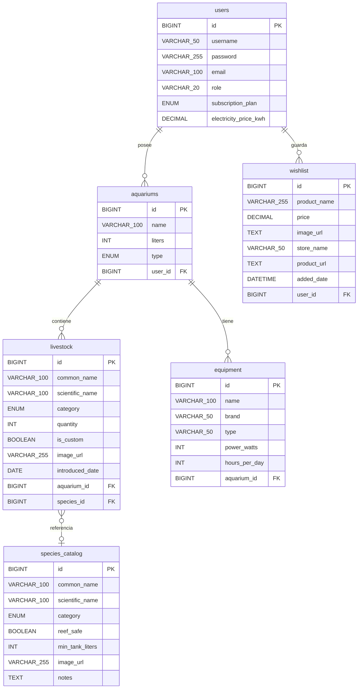

> **Motor de Base de Datos:** MySQL (Relacional) | **Estrategia de Persistencia:** Spring Data JPA con Hibernate (Java)

## 1. Diagrama Entidad-Relación

El modelo se basa en una jerarquía donde el **Usuario** es la entidad raíz que posee **Acuarios**. Cada acuario contiene **Equipamiento** y **Seres Vivos**. Los seres vivos se validan opcionalmente contra un **Catálogo de Especies** maestro. La **Wishlist** es una entidad independiente vinculada al usuario y alimentada por el Scraper de Python.

---

## 2. Diccionario de Datos (Tablas)

### 👤 Tabla: `users`

Almacena la información de acceso, perfil y plan de suscripción.

| **Campo**                 | **Tipo**      | **Restricciones**       | **Descripción**                                                       |
| ------------------------- | ------------- | ----------------------- | --------------------------------------------------------------------- |
| `id`                      | BIGINT        | PK, AUTO_INCREMENT      | Identificador único.                                                  |
| `username`                | VARCHAR(50)   | UNIQUE, NOT NULL        | Nombre de usuario para login.                                         |
| `password`                | VARCHAR(255)  | NOT NULL                | Hash BCrypt de la contraseña.                                         |
| `email`                   | VARCHAR(100)  | UNIQUE, NOT NULL        | Correo electrónico de contacto.                                       |
| `role`                    | VARCHAR(20)   | NOT NULL                | `'ROLE_USER'`, `'ROLE_ADMIN'`.                                        |
| `subscription_plan`       | ENUM          | NOT NULL, DEFAULT 'FREE' | `'FREE'` (1 acuario, sin calculadora) o `'REEFMASTER'` (ilimitado). |
| `electricity_price_kwh`   | DECIMAL(5,4)  | DEFAULT 0.1800          | Precio del kWh en €, configurable por el usuario en su perfil.       |

> **Regla de negocio (backend):** Al crear un acuario, el `AquariumService` comprueba `subscription_plan`. Si es `FREE` y ya existe 1 acuario para ese usuario, lanza un `403 Forbidden` con mensaje `"Límite de plan gratuito alcanzado"`. El acceso a la calculadora energética también se valida en el service layer.

---

### 🌊 Tabla: `aquariums`

Representa cada proyecto de acuario del usuario.

| **Campo**  | **Tipo**     | **Restricciones**  | **Descripción**                                  |
| ---------- | ------------ | ------------------ | ------------------------------------------------ |
| `id`       | BIGINT       | PK, AUTO_INCREMENT | Identificador único.                             |
| `name`     | VARCHAR(100) | NOT NULL           | Nombre descriptivo (ej: "Reef Central").         |
| `liters`   | INT          | NOT NULL           | Volumen total en litros.                         |
| `type`     | ENUM         | NOT NULL           | `'MARINO_PECES'` o `'MARINO_ARRECIFE'`.          |
| `user_id`  | BIGINT       | FK (`users.id`)    | Propietario del acuario.                         |

> **Regla de negocio:** El campo `type` es clave para la alerta de compatibilidad. Si `type = 'MARINO_ARRECIFE'` y se intenta añadir un ser vivo con `reef_safe = false`, el servicio lanza una advertencia.

---

### 🐠 Tabla: `livestock` (Seres Vivos)

Gestión de fauna actual en el acuario.

| **Campo**          | **Tipo**     | **Restricciones**            | **Descripción**                                          |
| ------------------ | ------------ | ---------------------------- | -------------------------------------------------------- |
| `id`               | BIGINT       | PK, AUTO_INCREMENT           | Identificador único.                                     |
| `common_name`      | VARCHAR(100) | NOT NULL                     | Nombre común (ej: "Pez Payaso").                         |
| `scientific_name`  | VARCHAR(100) | -                            | Nombre científico en latín.                              |
| `category`         | ENUM         | NOT NULL                     | `'PEZ'`, `'CORAL'`, `'INVERTEBRADO'`.                    |
| `quantity`         | INT          | DEFAULT 1                    | Cantidad de ejemplares.                                  |
| `is_custom`        | BOOLEAN      | DEFAULT FALSE                | `TRUE` si fue añadido manualmente (sin usar el catálogo).|
| `image_url`        | VARCHAR(255) | -                            | Foto del ejemplar.                                       |
| `introduced_date`  | DATE         | NOT NULL, DEFAULT CURDATE()  | Fecha de introducción al tanque. Necesario para trazabilidad. |
| `aquarium_id`      | BIGINT       | FK (`aquariums.id`)          | Acuario donde reside.                                    |
| `species_id`       | BIGINT       | FK (`species_catalog.id`), NULLABLE | Referencia al catálogo maestro. NULL si `is_custom = true`. |

---

### 🔌 Tabla: `equipment`

Inventario técnico de cada acuario.

| **Campo**       | **Tipo**     | **Restricciones**  | **Descripción**                                              |
| --------------- | ------------ | ------------------ | ------------------------------------------------------------ |
| `id`            | BIGINT       | PK, AUTO_INCREMENT | Identificador único.                                         |
| `name`          | VARCHAR(100) | NOT NULL           | Nombre del equipo.                                           |
| `brand`         | VARCHAR(50)  | -                  | Marca (ej: "Tunze", "Eheim").                                |
| `type`          | VARCHAR(50)  | NOT NULL           | `'ILUMINACION'`, `'BOMBA'`, `'SKIMMER'`, `'CALEFACTOR'`, etc. |
| `power_watts`   | INT          | -                  | Potencia en vatios del aparato.                              |
| `hours_per_day` | INT          | DEFAULT 8          | Horas de uso diario. **Necesario para la calculadora energética.** |
| `aquarium_id`   | BIGINT       | FK (`aquariums.id`)| Acuario al que pertenece.                                    |

> **Fórmula calculadora (solo REEFMASTER):**
> `Gasto mensual (€) = (power_watts / 1000) × hours_per_day × 30 × electricity_price_kwh`

---

### 📋 Tabla: `wishlist`

Almacén de productos detectados por el Scraper que el usuario decide guardar.

| **Campo**       | **Tipo**      | **Restricciones**           | **Descripción**                                 |
| --------------- | ------------- | --------------------------- | ----------------------------------------------- |
| `id`            | BIGINT        | PK, AUTO_INCREMENT          | Identificador único.                            |
| `product_name`  | VARCHAR(255)  | NOT NULL                    | Nombre extraído de la tienda.                   |
| `price`         | DECIMAL(10,2) | -                           | Precio detectado por Python en el momento del scraping. |
| `image_url`     | TEXT          | -                           | URL de la imagen del producto.                  |
| `store_name`    | VARCHAR(50)   | -                           | Tienda origen (ej: "CoralReef", "Tiendanimal"). |
| `product_url`   | TEXT          | -                           | Enlace directo (puede incluir parámetro de afiliado). |
| `added_date`    | DATETIME      | NOT NULL, DEFAULT NOW()     | Fecha y hora en que se guardó en la wishlist. Los precios son volátiles. |
| `user_id`       | BIGINT        | FK (`users.id`)             | Usuario propietario del item.                   |

---

### 📚 Tabla: `species_catalog` (Catálogo Maestro)

Tabla de solo lectura (seed), usada para el buscador ("Atlas") y la validación de compatibilidad. No es editable por usuarios normales.

| **Campo**          | **Tipo**     | **Restricciones**  | **Descripción**                                                             |
| ------------------ | ------------ | ------------------ | --------------------------------------------------------------------------- |
| `id`               | BIGINT       | PK, AUTO_INCREMENT | Identificador único.                                                        |
| `common_name`      | VARCHAR(100) | NOT NULL           | Nombre común (ej: "Pez Payaso").                                            |
| `scientific_name`  | VARCHAR(100) | UNIQUE             | Nombre científico en latín.                                                 |
| `category`         | ENUM         | NOT NULL           | `'PEZ'`, `'CORAL'`, `'INVERTEBRADO'`.                                       |
| `reef_safe`        | BOOLEAN      | NOT NULL           | **Clave de compatibilidad.** `FALSE` = incompatible con acuarios de arrecife. |
| `min_tank_liters`  | INT          | NOT NULL           | Litros mínimos recomendados. Permite alertar si el acuario es demasiado pequeño. |
| `image_url`        | VARCHAR(255) | -                  | Imagen representativa de la especie.                                        |
| `notes`            | TEXT         | -                  | Notas de comportamiento o cuidados especiales.                              |

> **Lógica de compatibilidad (backend):** Al añadir un ser vivo a un acuario `MARINO_ARRECIFE`, el `LivestockService` consulta `species_catalog.reef_safe`. Si es `false`, retorna un `200 OK` con un campo `warning: "Esta especie no es apta para acuarios de arrecife"`. No bloquea la acción, solo avisa.

---

## 3. Integridad y Relaciones (Casuística JPA)

1. **One-To-Many (`users` → `aquariums`):** Un usuario posee múltiples acuarios. Borrar un usuario elimina todos sus acuarios en cascada (`CascadeType.ALL`).

2. **One-To-Many (`aquariums` → `livestock` / `equipment`):** El acuario es el contenedor. Borrar un acuario elimina toda su fauna y equipamiento (`orphanRemoval = true`).

3. **Many-To-One (`wishlist` → `users`):** Múltiples items de wishlist pertenecen a un único usuario.

4. **Many-To-One (`livestock` → `species_catalog`):** Opcional (NULLABLE). Un ejemplar puede referenciar el catálogo maestro para validar compatibilidad, o ser un ítem personalizado (`is_custom = true`) sin referencia.

---

## 4. Estrategia de Carga de Datos (Seed — `data.sql`)

Para la presentación y los tests, el archivo `data.sql` precargará:

- **1 Usuario FREE** de test (`user_free` / `password123`).
- **1 Usuario REEFMASTER** de test (`user_pro` / `password123`).
- **1 Acuario** por usuario con fauna y equipamiento de ejemplo.
- **~20 especies** en `species_catalog`, incluyendo ejemplos `reef_safe = false` (ej: Pez Ballesta) para demostrar la alerta en la presentación.
